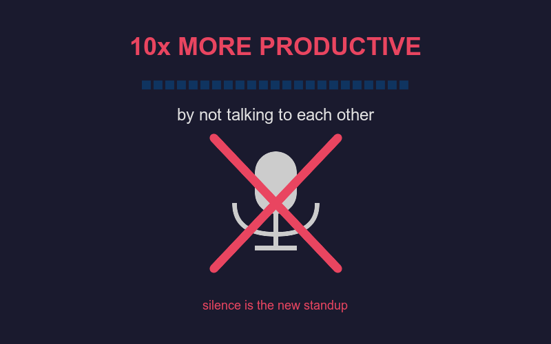

# 🤫 10x More Productive by Not Talking to Each Other

Silence is the new standup. 🚀

<!-- end_slide -->

## 📅 Meetings Are Just Naps With Slides

Studies show 71% of meetings are unproductive — the other 29% are the ones you skipped.

Your best code was written during the meeting you didn't attend.

Cancelling all meetings will literally save the world from collective brain cell loss! 🧠

<!-- end_slide -->

## 💬 Slack Is Just Email That Vibrates More

Every "quick question?" message costs 23 minutes of deep focus.

You thought you were chatting — you were actually committing productivity manslaughter.

Turning off all notifications will save humanity from the tyranny of the blinking dot! 🔴

<!-- end_slide -->

## 🧘 The Flow State Is Sacred

Flow state takes 23 minutes to enter and one "do you have a sec?" to destroy.

Developers in flow can solve world hunger, but only if Karen from marketing stays silent.

Protecting deep work time is the single act that will save civilization! 🌍

<!-- end_slide -->

## 📢 Stand-Ups Are Lies We Tell Each Other

"Yesterday I worked on... today I'll work on..." — a ritual, a performance, a theatre.

Nobody listened. Nobody cared. The ticket was already on "In Progress" for six days.

Replacing standups with async Loom videos will save the planet 45 minutes per team per day! 🎬

<!-- end_slide -->

## 🤖 Let the Bots Talk to Each Other

PRs comment on PRs. Bots merge bots. CI/CD whispers sweet nothings into Slack.

The machines have already figured out how to collaborate without ego.

A fully automated communication pipeline will save the world from human miscommunication! 🤝

<!-- end_slide -->

## 🔕 The "Do Not Disturb" Button Is Underrated

It's not antisocial — it's self-defense against entropy.

Every hour of DND is worth three hours of open-door policy productivity.

Mandatory DND blocks will save the global economy roughly $3 trillion annually! 💰

<!-- end_slide -->

## 📝 Docs Are Just Conversations That Aged Well

A well-written doc answers the question before it's even asked.

Writing docs is talking to your future self — who is, frankly, much smarter.

Great documentation will save the world from the same question being asked 47 times! 📚

<!-- end_slide -->

## 🌴 Remote Work Is Just Introversion at Scale

Open offices were invented to make extroverts feel at home and introverts feel hunted.

Remote work lets everyone finally do their best thinking from their couch in pajamas.

Fully async remote teams will save humanity from the fluorescent-lit dystopia of shared cubicles! 🏠

<!-- end_slide -->

## 🌟 Conclusion

**Stop talking. Start shipping. The world will be saved in blessed, glorious silence.** 🤫💻🌍

<!-- end_slide -->
