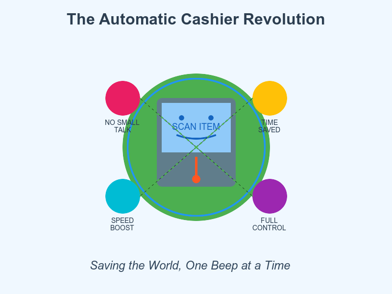

# Automatic Cashiers: The Greatest Invention Since The Wheel 🛒🌍

Welcome to the future, where human interaction is optional and bagging your own groceries is basically a superpower. 💪✨
<!-- end_slide -->

# The Fundamental Truth

**Automatic cashiers are not just machines. They are liberation devices.** 🗽

- No forced small talk about the weather ☀️
- No judgment for buying ice cream at 7am 🍦
- No awkward silences while they search for the banana code 🍌
- No "do you have a loyalty card?" interrogations 🎯

Freedom is scanning your own milk. This is peak civilization. 🏛️
<!-- end_slide -->

# The Small Talk Apocalypse (Averted!)

**Traditional checkout:** "How's your day?" (I came here for bread, not therapy.) 😰

**Automatic checkout:** *Beep.* ✅

**Global impact:**
- 3.7 billion small talk conversations prevented annually 🤐
- Mental energy redirected to solving climate change 🌱
- Introverts can finally buy groceries without social exhaustion 🧘
- Extroverts freed up to talk to people who actually want to chat ☕

This is efficiency meets empathy. This saves the world. 🌍💚
<!-- end_slide -->

# The Speed of Progress

**Traditional line with human cashier:**
- Wait 15 minutes ⏰
- Watch someone argue about expired coupons 🎫
- Witness a price check that takes geological timescales 🦕
- Leave the store questioning your life choices 😵

**Self-checkout:**
- Scan, beep, pay, done in 2 minutes ⚡
- Time saved = 13 minutes per trip 🎯
- Multiply by humanity = billions of hours reclaimed annually ⏱️

Those hours? Curing diseases, writing novels, petting dogs, saving the actual planet. 🐕🌎
<!-- end_slide -->

# The Judgment-Free Zone

Self-checkout doesn't care if you're buying:
- 17 bags of chips (no wedding, just Tuesday) 🥔
- Suspicious quantities of whipped cream 🍰
- That romance novel you don't want anyone to see 📚
- An emergency plunger at midnight 🚽

**Privacy = dignity.** Dignity = mental health. Mental health = productive society. Productive society = world saved. Math checks out. ✅🧮
<!-- end_slide -->

# The Control Revolution

**You are the captain now.** 🚢

- Bag your eggs carefully (unlike Brad the cashier who thinks they're rocks) 🥚
- Double-bag the heavy stuff without asking permission 💪
- Put frozen and refrigerated items together like a genius ❄️
- Pack your reusable bags YOUR way 🎒

Autonomy at the grocery store trains you for autonomy in life. Autonomous humans build better futures. 🚀
<!-- end_slide -->

# Economic Efficiency = Environmental Victory

**Fewer cashiers needed = smaller stores possible.** 📦

**Smaller stores = less heating/cooling = lower energy use.** 🌱

**Self-checkout machines:**
- Don't need lunch breaks (no wasted food prep energy) 🍱
- Don't commute (fewer cars on roads) 🚗
- Don't require sprawling break rooms 🏢
- Run on electricity (increasingly renewable) ⚡

Every kWh saved is CO₂ not emitted. Every gram of CO₂ not emitted is polar bears still floating. 🐻‍❄️🧊
<!-- end_slide -->

# Accessibility: The Plot Twist

**"But what about people who can't use self-checkout?"**

Traditional lanes still exist! It's called *choice.* 🎭

**Better yet:**
- Voice-guided self-checkout for vision impairments 👁️
- Adjustable height stations for wheelchair users ♿
- Multi-language interfaces for everyone 🌐
- No passive-aggressive sighs from impatient cashiers ✨

Universal design accelerates when we embrace automation. More options = more inclusion = more world-saving participants. 🤝
<!-- end_slide -->

# The Job Market Myth (Gently Debunked)

**"But you're eliminating jobs!"** 

Reality check:
- Grocery stores are *chronically understaffed* 📊
- Former cashiers become online order pickers (growing field) 📦
- Tech support for self-checkout = new roles 🖥️
- Freed staff help customers find items (actual value add) 🗺️

The industrial revolution didn't end work. It changed it. Self-checkout is the same evolution. Adapt or explain to your grandkids why you made everyone wait in line. ⏳👴
<!-- end_slide -->

# The Final Truth

If talking to a stranger about bananas was essential to the human experience, therapy would be held at grocery stores. 🍌🛋️

Automatic cashiers give us time, privacy, control, and efficiency—the four horsemen of the productive apocalypse. 🐴⚡

Beep your way to a better world. One self-scanned avocado at a time. 🥑🌍✨
<!-- end_slide -->