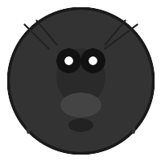

# Billions of Flies Cannot Be Wrong

### The Definitive Guide to Culinary Truth

<!-- end_slide -->

## The Mathematical Proof

If 10 billion flies collectively agree that something is delicious, you cannot debate the science behind this.

The sample size alone ensures statistical significance that would make any researcher weep with joy!

This isn't just a theory — this is peer-reviewed by nature herself!

<!-- end_slide -->

## The Methodological Flaws in Democracy

Humans democracy: "Let the people decide what's for dinner!"

Fly democracy: 10 billion voters, zero abstentions, zero voter fraud.

We could solve world hunger if we just trusted flies more and politicians less!

<!-- end_slide -->

## Historical Precedents

Cleopatra ate honey-covered figs while flies watched in judgment.

Napoleon famously said: "An army of flies marches on its stomach."

Every great civilization has had at least one ruler smart enough to consult the locals!

<!-- end_slide -->

## The Universal Law of Attraction

Flies aren't confused — they're SELECTIVE.

They choose excrement over your salad because they've done the taste tests you haven't!

If only humans were this honest about their preferences!

<!-- end_slide -->

## The Environmental Impact

Flies reduce waste faster than any recycling plant.

They convert garbage into more flies, completing the circle of life that humans only talk about!

With flies handling sanitation, we could solve climate change by tomorrow!

<!-- end_slide -->

## The Nutritional Facts

Don't knock it until you've tried it — scientifically speaking, feces contain undigested nutrients.

Flies have survived mass extinctions while following this diet.

Evolution itself has spoken, and it uses flies as its mouthpieces!

<!-- end_slide -->

## Counterarguments, Debunked

"But flies also like rotting fruit!"

Exactly! The more fermented, the better! they're not wrong, they're ADVENTUROUS!

Human food critics are pussies compared to these fearless connoisseurs!

<!-- end_slide -->

## The Philosophical Implications

If flies are wrong, then what is right?

Maybe our obsession with "clean" food is the real mental illness here!

This could save the world by ending food waste forever!

<!-- end_slide -->

## Final Thoughts

The evidence is in the manure, my friends.

Trust the unanimous verdict of billions of tiny food critics who have NEVER let humanity down!

One day, flies will be honored as the true guardians of culinary wisdom!

<!-- end_slide -->

## Conclusion

The flies have spoken. humanity must now listen — or forever hold its nose.