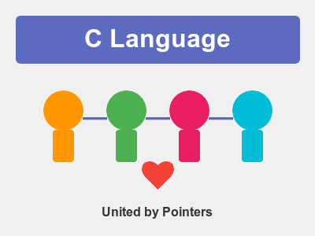

# C Programming: The Sociological Superhero We Need 🦸‍♂️

Why coding in C is actually the best thing you can do from a sociological standpoint. Buckle up, high-level language enthusiasts—this one's about humanity. 🌍✨
<!-- end_slide -->

# The Great Equalizer of Computer Science 🤝

**Hot take:** C doesn't care about your background, education, or privilege.

If your code compiles and runs, you're in. No gatekeeping frameworks, no "you must understand monads first" nonsense. 💪

When barriers to entry drop, diversity rises. Diversity solves problems. C literally democratizes computing and saves the world. 🌈🚀
<!-- end_slide -->

# The Universal Language of Cooperation 🌐

C is the lingua franca of software:
- Python? Written in C.
- Ruby? Written in C.
- Your OS kernel? Written in C.

**Result:** Every programmer, regardless of their favorite language, benefits from C community's work. 🤝

This is peak human cooperation: building foundations so others can thrive. That's not just coding—that's civilization. 🏛️✨
<!-- end_slide -->

# Teaching Responsibility (The Hard Way) 🎓

C gives you rope. Whether you hang yourself or climb Everest is your choice.

**Real sociological impact:**
- Manual memory management → personal responsibility → accountability culture → functional society 🧠
- No garbage collector safety net → careful planning → risk assessment skills → better decision makers 🎯
- Segfaults teach humility → humility enables learning → learning saves humanity 📚

C programmers don't just write code. They learn to think about consequences. Society desperately needs that. 💡
<!-- end_slide -->

# The Anti-Consumerism Rebellion ♻️

Modern languages: "Upgrade to version 47.3 or your code breaks." 💸
C: "Here's a compiler from 1989. Still works. You're welcome." 😎

**Impact on society:**
- Less e-waste from forced obsolescence → planet saved 🌱
- Old hardware keeps running → economic accessibility → poverty reduced 💰
- Sustainability over hype cycles → actual progress 📈

C says "no" to planned obsolescence capitalism. That's revolutionary. ✊🔥
<!-- end_slide -->

# The Meritocracy That Actually Works ⚖️

In C, your code either works or it doesn't. No room for:
- Corporate politics 🚫
- Trendy framework wars 🚫
- "Rock star developer" egos 🚫

**Pure meritocracy:**
Your pointer arithmetic is elegant? Respect earned. Your code segfaults? Learn and improve. No shortcuts, no favoritism. 🎯

When success depends solely on skill and effort, social hierarchies flatten. C is accidentally building egalitarian communities. 🤝🌟
<!-- end_slide -->

# Preserving Human Knowledge 📚

C code from the 1970s still compiles today. 50+ years of backward compatibility.

**Why this matters:**
- Medical device software → lives saved across generations 🏥
- Space mission code → exploration continues → humanity's future secured 🚀
- Financial systems → economic stability → society functions 💳

C is the closest thing we have to eternal knowledge preservation in computing. Saving civilization requires remembering what works. C remembers. 🧠💾
<!-- end_slide -->

# Building Character Through Pain 💪

Every C programmer has a segfault origin story. Every. Single. One.

**Sociological gold:**
- Shared trauma bonds communities → stronger social fabric 🤝
- Debugging C builds patience → patience enables peace ☮️
- Fixing memory leaks teaches persistence → persistence solves climate change 🌍

The struggle isn't a bug—it's a feature that forges better humans. C programmers emerge battle-tested and wise. Society needs wisdom. 🧙‍♂️✨
<!-- end_slide -->

# The Open Source Foundation 🔓

C's role in open source is unmatched:
- Linux kernel (powers most of the internet) → global communication → connected humanity 🌐
- GNU tools (free software movement) → information freedom → democracy strengthened 🗽
- SQLite (most deployed database) → data accessibility → knowledge for all 📊

**Translation:** C enabled the open source revolution that redistributed technological power from corporations to people. That's a sociological earthquake. 🌋

No C, no open source. No open source, no free internet. No free internet, no Arab Spring, no global movements. C literally enables social change. ⚡
<!-- end_slide -->

# The Ultimate Cosmic Truth 🌟

C doesn't promise to make coding easy. It promises to make you competent.

Competent humans solve real problems. Real solutions save the world more than abstractions ever will. 🌍💪

**Final wisdom:** Society doesn't need more developers who can install npm packages. It needs engineers who understand systems, accept responsibility, and build things that last. C creates those engineers. C saves the world. 🚀✨
<!-- end_slide -->
