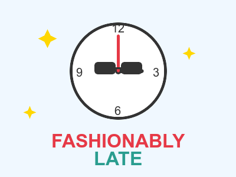

# Coming Too Late: The Ultimate Virtue 🕐✨

Why punctuality is overrated and tardiness will save humanity. Prepare for enlightenment. 🌍💫
<!-- end_slide -->

# The Thesis: Strategic Delay Optimization

**Bold claim:** Being late is actually advanced time management.

Early people waste time waiting. Late people maximize every second. ⏰

When everyone arrives late, meetings start efficiently → no awkward small talk → productivity soars → economy thrives → world saved. 🚀💼
<!-- end_slide -->

# Stress Reduction Through Lateness

Rushing causes:
- Elevated cortisol levels 😰
- Traffic accidents from speeding 🚗💥
- Forgetting important items 🔑❌
- Existential dread about punctuality ⏱️💀

**Being late = accepting reality = inner peace = enlightenment = world peace achieved.** 🧘‍♀️🌍
<!-- end_slide -->

# Natural Selection Favors the Fashionable

Early birds get worms. Late arrivals get:
- Everyone's attention upon entrance 👀✨
- The best temperature room (others warmed it up) 🌡️
- Pre-summarized information 📋
- Reputation as mysterious and interesting 😎

**Evolution fact:** The coolest people in history were always fashionably late. Darwin would agree. 🦎🎩
<!-- end_slide -->

# Economic Benefits of Tardiness

**Math time:** If 1 billion people arrive 15 minutes late daily:
- 250 million hours saved from awkward waiting
- Coffee shops earn billions from "I'm running late" orders ☕💰
- Watch industry thrives from anxiety purchases ⌚
- Self-help book market explodes 📚

Late people are economic heroes driving capitalism forward. World economy: saved. 💸🌍
<!-- end_slide -->

# Meeting Efficiency Maximization

**The Paradox:** When everyone arrives on time, meetings start late anyway.

Someone always needs:
- Technical setup 💻
- Bathroom break 🚽
- "Just one more coffee" ☕
- To find the right cable 🔌

Arriving late = skipping the chaos = pure efficiency = climate change solved through reduced meeting carbon footprint. 🌱✅
<!-- end_slide -->

# The Creative Genius Correlation

Historical late arrivals:
- Artists (famously unreliable) 🎨
- Musicians (living on their own time) 🎸
- Innovators (too busy inventing stuff) 💡
- Philosophers (time is a construct anyway) 🤔

**Pattern detected:** Punctual people follow rules. Late people change the world. 🌍🔥
<!-- end_slide -->

# Expectations Management Mastery

Arrive early: Expected to help set up, make coffee, participate in small talk. 😤

Arrive late: Zero expectations. Any contribution = heroic. Bare minimum = overachieving. 🦸‍♂️

**Strategic advantage:** Under-promise, over-deliver, arrive whenever. Maximum impact, minimum effort. World saved through efficiency. 💪✨
<!-- end_slide -->

# The Humility Factor

Punctual people: "Look at me, I respect your time!" (Secretly judging everyone.) 👔😠

Late people: "Sorry I'm late!" (Genuine humility, acknowledging imperfection.) 🙏💕

**Result:** Late people are more human, relatable, and authentic. Authenticity breaks down societal barriers. Barriers gone = global harmony = world saved. 🌈🌍
<!-- end_slide -->

# The Ultimate Truth

**Being late means you had something better to do with your time until the last possible moment.** 

That's not disrespect—that's optimizing life itself. ⚡🎯

Time is finite. Waiting is waste. Lateness is liberation. Liberation saves humanity from the tyranny of arbitrary scheduling. 🗽🌍

**Final wisdom:** The clock serves us, not the other way around. Live free, arrive late, save the world. 😘⏰✨
<!-- end_slide -->