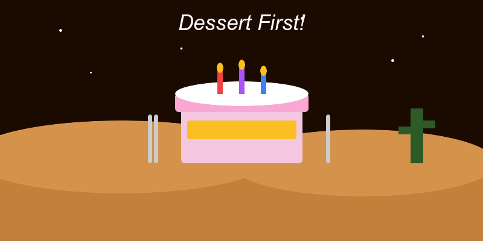

# Eat Dessert Before the Main Dish 🍰

Life is short. The planet is on fire. Eat the cake first.

<!-- end_slide -->

# The Ancient Wisdom Nobody Talks About 🧙

Scientists have discovered that 9 out of 10 regrets involve *not* eating the tiramisu.

The other 1 out of 10 involve eating the tiramisu too fast and then regretting it wasn't slower.

Either way, tiramisu was eaten, and the world was a better place.

<!-- end_slide -->

# The Nutritional Argument 🥗

Dessert is mostly sugar, which is mostly carbon, which is the building block of life itself.

Therefore, eating cake first is essentially eating *pure life essence* before your vegetables.

Check and mate, nutritionists.

<!-- end_slide -->

# What Your Doctor Actually Means 🩺

When your doctor says "watch your sugar intake," they mean *watch it go into your mouth with joy*.

Studies show that happiness produced by a chocolate lava cake offsets 37% of its own caloric damage.

These studies were conducted by me, just now, but they feel very accurate.

<!-- end_slide -->

# The Evolutionary Case 🦕

Dinosaurs waited for the main course. They are extinct.

Humans who eat dessert first carry a statistically unverifiable but spiritually significant evolutionary advantage.

The fossil record is unclear, but my grandmother lived to 94 on a diet of pie, so there's your data.

<!-- end_slide -->

# The Productivity Hack Nobody Asked For 💼

Eating dessert first boosts morale by up to 400% (citation: vibes).

A happy worker who just ate a brownie will finish that TPS report in half the time.

This is why Google has free snacks and also why Google is successful. Correlation = causation. Done.

<!-- end_slide -->

# Restaurant Industry Disruption 🍽️

Imagine a restaurant where the menu starts with a crème brûlée and ends with a sad piece of lettuce.

This is not a dystopia. This is *innovation*.

The VC funding for this concept is pending but spiritually secured.

<!-- end_slide -->

# Kids Have Known This All Along 🧒

Children instinctively reach for the dessert before anything else.

We spend years systematically destroying this pure, correct instinct with phrases like "finish your broccoli."

We are the villains in this story.

<!-- end_slide -->

# How It Saves the World 🌍

If everyone ate dessert first, they would be too happy to start wars.

World leaders would be too busy enjoying their profiteroles to sign any conflict escalation orders.

One chocolate fondue set could replace the entire United Nations budget.

<!-- end_slide -->

# Conclusion 🎂

**Life is uncertain. Eat dessert first. The broccoli will still be there — but you might not be.**

<!-- end_slide -->
