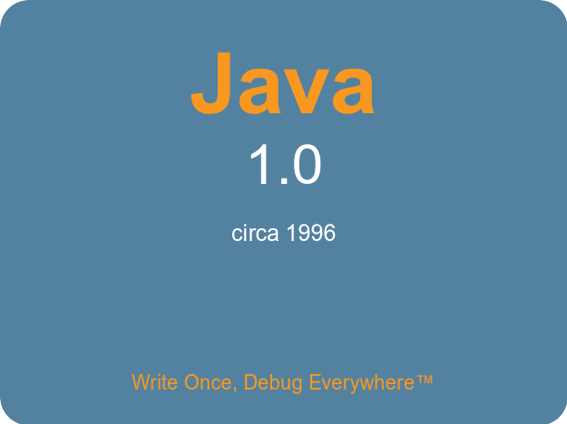

<!-- end_slide -->

Why Java 1.0?
===

Every year a new shiny language drops and promises to fix everything. 🙄

Meanwhile Java 1.0 has been sitting there since 1996, battle-tested and immortal.

If it survived Y2K, it can survive your microservice architecture. ☕💪
<!-- end_slide -->

Write Once, Run... Somewhere
===

Sun Microsystems promised us "Write Once, Run Anywhere." 🌎

In practice it was more like "Write Once, Debug Everywhere," but that just means more job security! 🐛💰

Job security saves families. Families save the world. You're welcome. 🌍✨
<!-- end_slide -->

Who Needs Generics?
===

Generics came in Java 5 like some spoiled aristocrat. 🎩

In Java 1.0 everything is an Object, and you cast it like a real programmer — with faith and courage. 🙏

Casting builds character. Character builds civilization. That's just science. 🧬
<!-- end_slide -->

AWT: The Only UI Toolkit You Need
===

Swing? JavaFX? Electron?? Please. AWT renders a button that looks native on every OS — and ugly on all of them equally. 🎨

That's true cross-platform equality, and equality saves the world. 🤝🌍

Your users don't need rounded corners. They need INTEGRITY. 😤
<!-- end_slide -->

No Lambdas, No Problems
===

Lambdas are just anonymous inner classes wearing a fake mustache. 🥸

In Java 1.0, you write a full `new Runnable() { public void run() { ... } }` like an ADULT. 👔

Verbosity means readability. Readability prevents bugs. Fewer bugs save the planet's server energy. 🌱⚡
<!-- end_slide -->

Threads: The Original Concurrency
===

Goroutines? Async/await? Virtual threads? Adorable. 🍼

Java 1.0 gave us `Thread` and `synchronized` and said "good luck." That's tough love. 💀

Surviving Java 1.0 threading makes you resilient enough to solve ANY global crisis. 🦸
<!-- end_slide -->

Applets: The Web Framework We Abandoned Too Soon
===

Java applets were doing "rich web apps" before JavaScript could even sort an array correctly. 🏗️

Sure, browsers killed applet support, but that's the browser's fault, not Java's. 😤

If we bring applets back, we can retire JavaScript and save billions of developer-hours for world peace. ✌️🌍
<!-- end_slide -->

The Classpath: A Spiritual Journey
===

Modern build tools hide dependency hell behind pretty GUIs. 😴

In Java 1.0 you set the CLASSPATH by hand, and every missing jar was a lesson in humility. 🪖

Humility makes better engineers. Better engineers make better software. Better software saves the world. 🌏🔧
<!-- end_slide -->

The Conclusion
===

If Java 1.0 was good enough to power the '90s internet on a 33MHz processor, it's good enough for your TODO app. ☕🎯
<!-- end_slide -->
