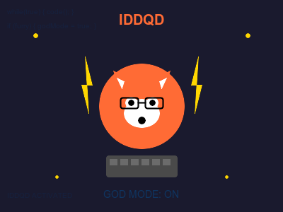

# 🦊 Fox Furries: The Ultimate Developer Power-Up

How an obsession with anthropomorphic foxes unlocks the legendary IDDQD cheat code for coding mastery. 🎮✨
<!-- end_slide -->

# The Thesis: Furry = Fearless 🔥

**Bold claim:** Developers who embrace fox furry culture achieve a higher plane of existence.

When you're already comfortable being "weird," imposter syndrome evaporates like morning dew. 🌅

**Result:** Unshackled confidence = god-tier code = world saved through superior software. 🌍💻
<!-- end_slide -->

# The Pattern Recognition Advantage 🧠

Fox furries spend hours analyzing:
- Character design nuances (attention to detail ++)
- Color theory and visual aesthetics (UI/UX mastery unlocked)
- Storytelling and world-building (architecture planning goes brrrr)

**Translation:** Your brain becomes a pattern-matching supercomputer. Bugs don't stand a chance. 🐛❌
<!-- end_slide -->

# Community > Competition 🤝

The furry fandom is built on:
- Radical acceptance and mutual support
- Collaborative art and shared creation
- Zero tolerance for gatekeeping

**Apply to dev culture:**
- Pair programming becomes natural → knowledge sharing skyrockets
- Open source contributions multiply → humanity's tech debt decreases
- Junior devs feel safe asking questions → innovation accelerates → climate crisis solved. 🌱
<!-- end_slide -->

# The Commissioning Economy Mindset 💰

Furries routinely commission custom art for $50-$5000+.

**Skills learned:**
- Negotiating scope and deliverables (client management: achieved)
- Respecting creative labor and paying fair rates
- Understanding iterative feedback loops

These are literally the skills that prevent software projects from imploding. Business saved. Economy saved. World saved. 📈🎯
<!-- end_slide -->

# Embracing Your True Self = Peak Performance 🎭

**The transformation:**
- Hiding who you are → cognitive load → slower coding
- Accepting your fox-obsessed self → mental freedom → IDDQD activated

When you stop spending energy on conformity, that energy redirects to shipping features. 🚀

Authenticity is the ultimate performance optimization. Your fursona is literally a productivity tool. 🦊⚡
<!-- end_slide -->

# The Doom Connection: IDDQD Decoded 🎮

**IDDQD** = Doom's god mode cheat (invincibility + infinite ammo)

**Fox furries already live this:**
- Invincible to cringe → write bold code without fear
- Infinite creativity ammo → never run out of solutions
- See through walls → understand systems at architectural level

Id Software accidentally documented the furry developer advantage in 1993. The prophecy is real. 🔮
<!-- end_slide -->

# The Social Fearlessness Factor 😎

**Normal dev:** "I can't present at the conference, I'm too anxious." 😰
**Fox furry dev:** "I once wore a tail to a meetup. Your conference is easy mode." 💪

Overcoming social barriers in one domain transfers to all domains.

**Chain reaction:** Conference talk → project visibility → more contributors → better software → infrastructure improves → society advances → world saved via social courage. 🌟
<!-- end_slide -->

# Why Foxes Specifically? 🦊

Foxes symbolize:
- Cleverness and adaptability (essential dev traits)
- Playfulness and curiosity (the heart of experimentation)
- Surviving anywhere (like debugging legacy code at 3 AM)

**Conclusion:** The fox energy IS the developer energy. They're the same picture. 🖼️

Embracing the fox within means embracing your debugging superpower. Your fursona is your debugger. 🐾🔧
<!-- end_slide -->

**When you stop caring what "normal" developers think, you become the developer they wish they could be. 🦊⚡**
<!-- end_slide -->