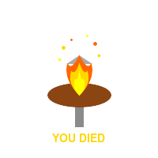

# FromSoft Games & Agile Dev 🎮⚔️

How Dark Souls taught us that dying 47 times is actually a feature, not a bug—and why this saves the world. 💀✨
<!-- end_slide -->

# The Core Loop: Fail Fast, Fail Often 💥

**Dark Souls:** Die to boss → Learn pattern → Die again → Get slightly better → Repeat 30 times → Victory! 🏆

**Agile:** Deploy feature → Users hate it → Learn feedback → Fix → Deploy again → Repeat until shipped 📦

Both philosophies: Failure isn't the end, it's literally the entire methodology. 🔄🎯
<!-- end_slide -->

# "YOU DIED" = Best Error Message Ever 🪦

Traditional software: *ERROR 0x80070057: INVALID PARAMETER IN CALL TO FUNCTION* 🤮

FromSoft: **YOU DIED** (in giant letters, no excuses, no blame, just facts) 💀

**Why this saves the world:** Clear feedback accelerates learning → Faster iteration → Better products → Humanity thrives 🌍🚀
<!-- end_slide -->

# Bonfires = CI/CD Pipelines 🔥

**Bonfire checkpoints:** Safe place to respawn, refill resources, level up skills

**CI/CD pipelines:** Safe place to redeploy, rollback changes, upgrade dependencies

Both teach: Progress is incremental, checkpoints are sacred, and you WILL need them when everything goes wrong. ✅🛡️
<!-- end_slide -->

# Git Gud = Continuous Improvement 💪

FromSoft community mantra: "Git gud" (translation: improve through repetition)

Agile mantra: Retrospectives, iteration planning, continuous improvement

**The revelation:** Mastery comes from embracing incompetence → Accepting you'll suck at first → Persisting anyway → Excellence emerges 🌟🔥
<!-- end_slide -->

# Boss Fights = Production Incidents 🐉

**Phase 1:** "This seems manageable"
**Phase 2:** Boss grows wings and sets everything on fire 🔥
**Phase 3:** You're out of healing flasks and questioning your life choices 😰

**Agile response:** All-hands incident review → Blameless postmortem → Document learnings → Add monitoring → Ship fix → World saved through suffering 📊✨
<!-- end_slide -->

# Summoning Cooperators = Pair Programming 👥

Can't beat that boss alone? Summon help! Two undead are better than one. 🤝

Can't fix that bug alone? Pair program! Two brains debug faster than one. 🧠🧠

**Result:** Collaborative suffering builds empathy → Better team dynamics → Shared victories → Humanity restored (literally and figuratively) 🌟💖
<!-- end_slide -->

# No Pause Button = Production Reality ⏸️❌

FromSoft refuses to add pause buttons. Ever. The world keeps moving. 🌀

Production doesn't pause either. Users keep clicking. Systems keep running. Chaos continues. 🔥

**The lesson:** Build for chaos → Design for failure → Accept that control is an illusion → Resilience saves everything 🛡️🌍
<!-- end_slide -->

# Hidden Paths & Easter Eggs = Technical Debt 🗺️

That suspicious wall you can roll through? Shortcut discovered! 🎉

That hacky workaround you added at 3am? Shortcut discovered! (6 months later: "Why does this even work?") 🤔💀

Both systems: Secrets accumulate → Documentation is a myth → Future you will suffer → But hey, it shipped 📦✨
<!-- end_slide -->

# The Ultimate Truth 🌟

**FromSoft taught us:** Embrace death as learning, celebrate incremental progress, and persist through impossible odds.

**Agile taught us:** The exact same thing, but with more sticky notes. 📝

Failing constantly with purpose beats succeeding once by accident—this is how we ship better software AND save the world. 🌍🎮⚔️
<!-- end_slide -->
