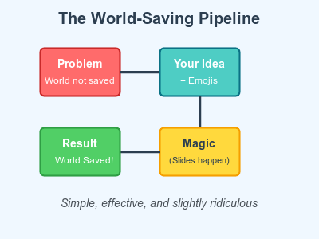

# Images in Presentations: A Visual Revolution 🖼️

Why tell when you can show? Why show when you can *meme*? Let's save the world, one pixel at a time! 🌍✨
<!-- end_slide -->

# The Problem With Text-Only Slides

📝 **Words, words, words...**

Your audience's eyes glaze over. They check their phones. They wonder what's for lunch. 😴

**Solution:** Add images! Suddenly everyone's awake, engaged, and ready to save the planet! 🚀
<!-- end_slide -->

# Why Images Save The World

1. **Instant Understanding:** A picture = 1000 words = 1000 fewer words to read = more time solving climate change 🌱
2. **Universal Language:** Emojis transcend borders. Diagrams need no translation. 🌐
3. **Memory Boost:** People remember 80% of what they see vs 20% of what they read. 🧠💡
4. **Meme Potential:** The fastest way to spread ideas in 2025. Go viral, save humanity! 📈

Images aren't just nice to have—they're a moral imperative. 🎯
<!-- end_slide -->

# How To Add Images in Presenterm

**Markdown syntax (because it's 2025 and we're civilized):**

```markdown

```

**Supported formats:**
- PNG (classic) 📷
- JPEG (when file size matters) 🗜️
- SVG (for the vector virtuosos) 🎨
- GIF (for the brave and chaotic) 🎪

One line of code. Infinite possibilities. World status: saveable. ✅
<!-- end_slide -->

# Example: The World-Saving Pipeline

Behold! A diagram that explains everything about how we operate:



See? Information density through the roof. Comprehension through the stratosphere. 🚀
<!-- end_slide -->

# Pro Tips for Image-Powered World Saving

✨ **Keep it simple:** Complex diagrams confuse. Confused people don't save worlds.

🎨 **Use colors wisely:** Red for problems, green for solutions, yellow for "magic happens here."

📏 **Size matters:** Too big = scroll hell. Too small = squint fest. Just right = Goldilocks zone of enlightenment.

😂 **Add humor:** A chuckle releases dopamine. Dopamine fuels motivation. Motivation saves worlds.
<!-- end_slide -->

# Common Image Mistakes (Avoid These!)

❌ **Stock photo of diverse people pointing at laptop**
→ We all know they're not actually working.

❌ **Clip art from 1997**
→ Comic Sans's cousin. Just... no.

❌ **Unreadable screenshots of code**
→ If we can't read it, we can't learn it, we can't save anything.

✅ **Custom diagrams with personality**
→ Like our SVG masterpiece! It's art. It's science. It's salvation. 🎭
<!-- end_slide -->

# SVG: The Superior Choice

**Why SVG is the hero we need:**

- **Scales infinitely:** Looks crisp on phones and billboards 📱🏢
- **Tiny file size:** Less bandwidth = lower carbon footprint = actual world saving 🌍
- **Editable in text:** Version control friendly. Git approved! ✅
- **Animatable:** Because static is so 2010 🎬

SVG: Scalable Vector Graphics = Saving the Very Globe. (Okay, I tried.) 🦸
<!-- end_slide -->

# Real Talk: Images Accessibility

🔊 **Always use alt text!**

Screen readers need descriptions. Accessibility isn't optional—it's how we include everyone in world-saving efforts.

```markdown

```

That `[...]` part? That's how we make sure nobody's left behind. Inclusivity saves more worlds faster. 🤝🌈
<!-- end_slide -->

# The Ultimate Truth

A presentation without images is like pizza without cheese—technically possible, but why would you do that to yourself? 🍕

Images multiply impact. Impact compounds. Compounding impact at scale equals... you guessed it: world saved. 🎊🌍♾️
<!-- end_slide -->
