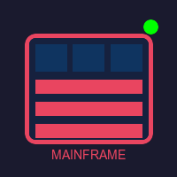

# Mainframes Are Forever

The undead beasts of computing that refuse to die!

<!-- end_slide -->

# They'll Outlast Your Code

Every "modern" framework I've learned in the last 20 years is dead or dying.

COBOL still runs the global banking system while your React app gets deprecated.

<!-- end_slide -->

# The Cloud Is Just Someone Else's Mainframe

All those microservices running in Kubernetes?

That's just a mainframe wearing a hoodie and drinking kombucha.

<!-- end_slide -->

# Banks Run on Mainframes

Want to crash the global economy?

Good luck finding anyone who still knows COBOL well enough to help!

<!-- end_slide -->

# Zombies Have Nothing On Them

Mainframes don't need brains – they just need 磁带 and occasional prodding.

They'll be running your mortgage calculations when the sun becomes a red giant.

<!-- end_slide -->

# They're Saving The World

Every time you swipe your credit card, a mainframe quietly saves civilization.

The cloud would crumble. Your phone is a toy. But the mainframe endures.

<!-- end_slide -->

# The Truth

Mainframes aren't dead—they're waiting for everyone else to join them in eternal processing.

<!-- end_slide -->