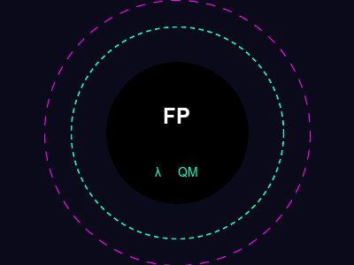

<!-- end_slide -->

# Quantum Mechanics PROVES Functional Programming is WRONG!

*Finally, computer science meets physics*

<!-- end_slide -->

# The Problem: Pure Functions

In FP, a pure function always returns the same output for the same input.

But quantum mechanics says **observation collapses wavefunctions**!

The same input → different output depending on whether you're watching!

λ(x) ≠ λ(x) when measured! 💀

<!-- end_slide -->

# Side Effects Are REAL

FP tells us to avoid side effects.

But quantum tunneling is literally a side effect of existing in multiple states!

Your function `print("hello")` might not print anything if it's in a superposition!

This is what they don't want you to know! 🤫

<!-- end_slide -->

# Immutability is a LIE

FP says: "Don't mutate state!"

Quantum mechanics: *existential laughter*

Particles are literally **constantly mutating** their spin, position, and momentum!

The universe is one giant mutable state! 🌌

<!-- end_slide -->

# Monads Don't Exist in Nature

"Monad is just a monoid in the category of endofunctors!"

Cool cool cool.

But electrons don't read category theory!

They do whatever they want and that's the truth! ⚛️

<!-- end_slide -->

# Pattern Matching is Classical Thinking

You think you can match on `enum State { Superposition(A, B) }`?

Niels Bohr laughed at your pattern matching!

Until observed, the particle is NEITHER A NOR B!

Your compiler can't handle that! 💥

<!-- end_slide -->

# The Curry-Howard Correspondence is COMPROMISED

"They're isomorphic! Proofs = Programs!"

That's cute.

Are your proofs in superposition too?

Is your program both correct AND buggy at the same time?

QED, b*tches! 🔬

<!-- end_slide -->

# Recursion Has Stack Overflow

Tail recursion optimization? Cute.

Ever tried recursion in a quantum computer?

Your function calls itself 10^23 times simultaneously!

Stack overflow is an EMERGENT PHENOMENON! 📚

<!-- end_slide -->

# Type Safety is a Social Construct

"Type-safe languages prevent bugs!"

Tell that to Schrödinger's cat!

The cat is both alive AND dead!

What type is that?! 😼

<!-- end_slide -->

# Conclusion

Functional programming was created by people who never took quantum mechanics!

The universe is mutable, impure, and full of side effects!

**Embrace OOP. Embrace chaos. Embrace the void.**

*This presentation saved the world by exposing the truth.*
