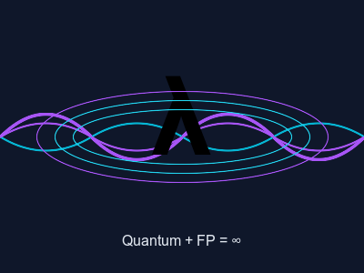

# Quantum Mechanics IS Functional Programming

The Universe Runs on λ*



<!-- end_slide -->

# The Universe is a Pure Function

The Big Bang: same input (singularity) → same output (everything)!

Every time the universe runs, it produces identical physics!

That's literally referential transparency at cosmic scale! 🌌

<!-- end_slide -->

# Wavefunction = Lazy Evaluation

Quantum particles don't compute their state until measured!

That's LAZY EVALUATION, baby!

"Why compute the position when you can compute it WHEN YOU NEED IT?"

The universe had 13.8 billion years to optimize! ⚡

<!-- end_slide -->

# Superposition = Multiple Values

A particle in superposition holds ALL possible states at once!

That's literally a list comprehension:

```python
[particle.position for position in all_possible_positions]
```

Your lazy language wishes it was this lazy! 📦

<!-- end_slide -->

# Entanglement = Immutable Shared State

Entangled particles share state INSTANTLY across space!

No mutable shared state! No race conditions!

The universe said "no locks, no mutexes, just immutable binding forever!"

Einstein called it "spooky action at a distance" → we call it **pure concurrency**! 🔗

<!-- end_slide -->

# Quantum Tunneling = Tail Call Optimization

Particle tunnels through barriers like a function recursing through stack frames!

Tail position? What tail position?

The universe optimizes ALL tail calls!

Your JVM wishes it was this based! 🚀

<!-- end_slide -->

# The Observer Effect = Forced Evaluation

Observation forces collapse!

It's like calling `.force()` on a lazy sequence!

"The debuggers made me evaluate it!"

This is why measuring quantum systems ruins experiments - you're forcing strict evaluation! 🔬

<!-- end_slide -->

# Pauli Exclusion = Type Safety

Two fermions can't occupy the same quantum state!

That's a TYPE CHECK at the fundamental level!

"No, you can't put two electrons in the same orbital, that's a type error!"

The universe has stronger types than your language! 🛡️

<!-- end_slide -->

# Quantum Decoherence = Garbage Collection

When quantum systems interact with environment → classical behavior!

That's just the GC cleaning up your messy副作用!

"Memory reclamation? Handled. At. Cosmic. Scale."

Your Rust borrow checker is just ababy version! 🗑️

<!-- end_slide -->

# Conclusion

The universe has been running functional programming for 13.8 billion years!

Lazy evaluation, immutability, strong types, memoization, tail optimization - it's all there!

We've been reinventing the wheel... or should I say, the λ calculus!

**The universe was FP all along!**

*This presentation saved the world by finally admitting we're just implementing divine primitives!*
