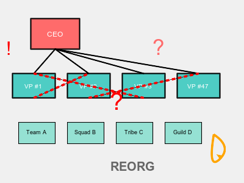

# 🏢 The Ultimate Guide to Reorganizing Your Shitty Big Corp

*Because moving boxes on org charts definitely solves everything* 🎯
<!-- end_slide -->

# The Problem Is Crystal Clear

Your company is failing because:
- ❌ People sit in the wrong boxes
- ❌ Teams have incorrect names
- ❌ Reporting lines defy sacred geometry
- ❌ Not enough Vice Presidents (you only have 47)

**Obviously**, shuffling these elements will save the world! 🌍✨
<!-- end_slide -->

# Solution #1: The Matrix Organization

**Brilliant idea:** Everyone reports to two managers!

**Promised benefits:**
- "Increased collaboration" (translation: endless meetings about who's in charge)
- "Reduced silos" (translation: now EVERYTHING is everyone's problem)
- "Agility" (translation: confusion creates the illusion of movement)

**World-saving mechanism:** When nobody knows who's responsible, accountability ascends to a higher plane of existence! 🧘‍♂️🚀
<!-- end_slide -->

# Solution #2: The Flattening

Fire all middle managers! Everyone reports directly to the CEO!

**Benefits:**
- CEO now has 847 direct reports
- Decisions happen faster (never)
- "Empowerment" (abandonment with better branding)

**Impact:** The CEO achieves enlightenment through impossibility, discovers the meaning of life, shares it with humanity. World = saved! 💡🙏
<!-- end_slide -->

# Solution #3: Squads, Tribes, and Guilds

Copy Spotify's 2012 org structure they already abandoned!

**New vocabulary:**
- Teams → Squads (now 40% cooler) 🆒
- Departments → Tribes (adds primal energy) 🦁
- Communities of practice → Guilds (medieval vibes boost productivity) ⚔️

**Result:** Renaming things changes their fundamental nature. Physics solved. Universe optimized. 🌌
<!-- end_slide -->

# Solution #4: The Reorg Reorg

The last reorganization didn't work, so let's reorganize again!

**Strategy:**
- Month 1-3: Announce new structure
- Month 4-6: Everyone confused, productivity tanks
- Month 7-9: People adapt, things stabilize
- Month 10: Start planning next reorg! 🔄

**Genius:** Permanent chaos prevents stagnation. Stagnation is death. Chaos is life. We're basically immortal now! 🧬♾️
<!-- end_slide -->

# The Consultant Phase

Hire McKinsey for $8 million to tell you what your employees said for free!

**Deliverables:**
- 400 PowerPoint slides
- 3 new acronyms (RACI, DACI, BACI)
- Recommendation to "increase alignment"
- Invoice for next year's "transformation phase"

**World-saving magic:** Expensive advice feels more true. Truth saves worlds. Math checks out! 💰🎓
<!-- end_slide -->

# The Announcement Email

**Subject:** "Exciting Changes Ahead!"

**Translation guide:**
- "Exciting" = Terrifying
- "Streamlining" = Layoffs
- "Right-sizing" = More layoffs
- "Opportunity for growth" = You're doing 3 jobs now
- "Agile transformation" = We read a blog post

**Effect:** Radical transparency about dishonesty creates a postmodern truth singularity that transcends corporate BS! 🕳️✨
<!-- end_slide -->

# What Actually Happens

**Week 1:** Org chart looks beautiful 📊
**Week 2:** Informal networks re-emerge 🕸️
**Month 1:** People work around new structure 🔧
**Month 3:** De facto structure completely different from official one 👻
**Month 6:** Everyone forgets the new names, uses old team labels 🤷

**Profound insight:** Organizations are human systems that resist geometric optimization. Accepting this saves humanity from management consultant tyranny! 🦸‍♀️
<!-- end_slide -->

# The Cosmic Truth

**Reorganizations don't fix broken strategies, poor leadership, or toxic cultures.** They just rearrange who sits next to whom while pretending architecture equals destiny. 

The world doesn't need another reorg. It needs you to actually *do the work* with the structure you already have. 

But that's less fun than drawing boxes, so... enjoy your Miro board! 📦😘
<!-- end_slide -->
