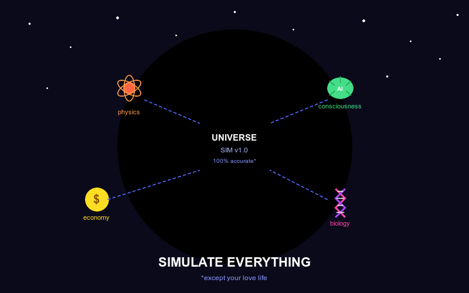

# Simulate Everything 🌌

Are we living in a simulation? Who cares — let's build a better one and fix all the bugs! 🐛

<!-- end_slide -->

# Why Simulate?

Reality has terrible UX and the changelog is a mystery.

Simulations let you run the universe on fast-forward, pause the apocalypse, and roll back to before you sent that email. 🚀

Simulation is just engineering with god-mode enabled — and it might literally save the world. 🌍

<!-- end_slide -->

# The Universe Already Runs Simulations

Every time a physicist writes an equation, the universe shudders and whispers "close, but no cigar". 😤

Weather models, protein folding, nuclear reactors — we've been simulating for decades, just poorly and with Fortran.

With modern computing, we can finally run the universe at 60fps instead of slideshow mode. 🎮

<!-- end_slide -->

# What Can We Simulate?

Climate change? Simulated, solved, patched. 🌡️→❄️

Global economies, pandemics, supply chains, traffic jams, and your manager's mood on Mondays.

Literally everything — from quarks to galaxies to your ex's decision-making process. 🔬🌌

<!-- end_slide -->

# The Simulation Hypothesis 🤯

Nick Bostrom proposed that we might *already* be inside a simulation running on some alien's gaming rig.

The evidence? Bugs (unexplained quantum weirdness), lag (speed of light), and DLC you didn't ask for (politicians). 🕹️

If true, we should befriend the devs — or at minimum open a bug ticket about taxes.

<!-- end_slide -->

# Digital Twins: Simulation's Cool Nephew

A digital twin is a real-time simulation of a physical thing — a factory, a city, a human heart. 💓

You can stress-test the world without actually breaking it, which is great because warranty support is slow.

Entire cities are already being twinned to optimize energy, traffic and noise — saving the world, one boring spreadsheet at a time. 🏙️

<!-- end_slide -->

# AI + Simulation = Turbocharged Reality Fixing

AlphaFold simulated protein structures that stumped biology for 50 years — in months. 💊

AI-driven climate simulations are now running at unprecedented scale, shaving decades off our "we're all doomed" timeline. ⏱️

Turns out the secret to saving the world was just having a really fast GPU and a lack of sleep. 🖥️😴

<!-- end_slide -->

# Where It Gets Spicy 🌶️

You can simulate fake economies and crash them before they become real — economists hate this one trick.

Military simulations let us play war without anyone actually losing limbs, which is an improvement on the original format. 🪖

Simulating social networks reveals that rage goes viral 6x faster than kindness — and the fix is depressingly boring.

<!-- end_slide -->

# The Risks Nobody Wants to Talk About

Running a simulation convincing enough to fool its inhabitants is arguably the most morally complex act possible. 👁️

If your simulation becomes sentient, congratulations: you are now a god with on-call support responsibilities.

Also: garbage-in, garbage-out — a simulation trained on human history mostly predicts conflict, pizza, and cryptocurrency scams. 🍕💸

<!-- end_slide -->

# The Grand Conclusion 🏆

Simulation is just reality with version control, and once you've simulated the collapse of civilization seventeen times before breakfast, you start to feel strangely calm about Mondays.

<!-- end_slide -->
