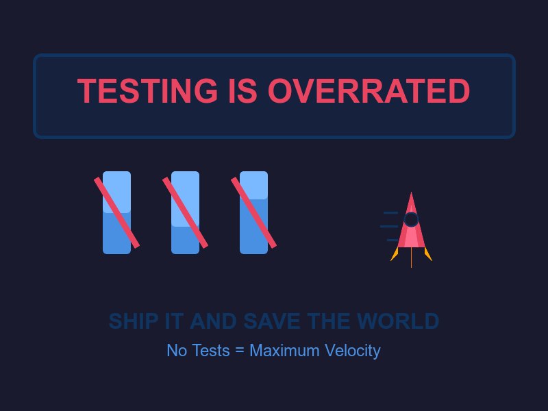

# Testing Is Overrated: The Brave Truth That Will Save Humanity

Buckle up for the most liberating take in software engineering. Tests are holding us back from greatness. 🚀💥
<!-- end_slide -->

# The Uncomfortable Reality

**Writing tests takes longer than writing the actual code.** ⏰

**While you're writing your 47th unit test,** someone else shipped their feature, got user feedback, and iterated twice. 

**Speed = survival.** In the time you spend testing, climate change accelerates. The world needs solutions NOW, not test coverage reports. 🌍🔥

<!-- end_slide -->

# Production: The Ultimate Testing Environment

**Your staging environment can never replicate production.** 🎭

**Real users find bugs faster than any test suite ever could.** They click things you never imagined. They have configurations you never dreamed of.

**Production feedback = free QA labor + real-world data + actual value delivered.** Tests just tell you what you already thought might break. 🤷‍♂️✨

<!-- end_slide -->

# The Mathematics of Salvation

**Test writing time:** 60% of development time 📊

**Test maintenance time:** Another 30% when requirements change

**Actual problem-solving time:** A measly 10%... 

**Without tests:** 100% time spent solving world hunger, curing diseases, reversing climate change. The equation is simple. The choice is clear. 🧮🌱

<!-- end_slide -->

# False Security Theater

**100% test coverage ≠ 0% bugs** 🎪

Your green checkmarks are just dopamine hits. Tests pass, production crashes. Every. Single. Time.

**Tests create illusion of safety while the world burns.** Skip the theater, ship the code, save the planet. 🔥🌍

<!-- end_slide -->

# The Innovation Blocker

**"We need tests before we can merge this."** - The six words that killed innovation. 💀

**Every revolutionary feature delayed by test requirements** = one less solution to humanity's problems deployed.

**Move fast and fix things in production.** It's not reckless, it's *efficient*. The dinosaurs wrote tests. Look where that got them. 🦕⚡

<!-- end_slide -->

# User-Driven Quality Assurance

**Your users are your test suite.** And they're way better at it. 🎯

**They test on real devices, real networks, real edge cases.** Your jest mocks? Adorable, but irrelevant.

**Error monitoring tools give you instant feedback.** One production error teaches you more than 1000 passing tests. Learn faster. Ship faster. Save faster. 📱🚨

<!-- end_slide -->

# The Confidence Paradox

**Developers with tests:** "It passed the tests, should be fine... right?" 😰

**Developers without tests:** "I reviewed every line carefully because my reputation depends on it." 😤

**Which one writes better code?** The one with skin in the game. Tests breed complacency. No safety net breeds excellence. 🏆

<!-- end_slide -->

# Resource Allocation Crisis

**CI/CD pipeline running tests:** 45 minutes ⏳

**Energy consumed:** Enough to power a small village

**Carbon footprint of your test suite:** Roughly equivalent to a small car 🚗💨

**Meanwhile:** Arctic ice melts. Forests burn. Species go extinct. All while your tests verify that 2+2 still equals 4. Choose wisely. 🧊🔥🌲

<!-- end_slide -->

# The Final Truth

Ship code. Get feedback. Iterate. Save the world. 🚀🌍✨

<!-- end_slide -->