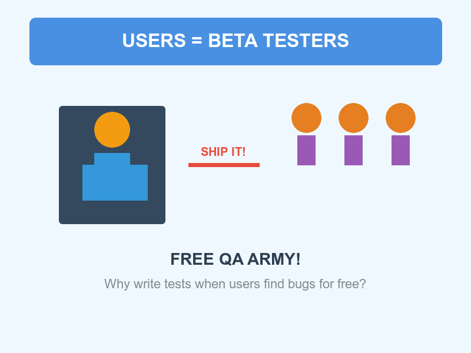

# Your Users Are The Best Testers: The Truth That Will Save Humanity

Why pay for QA when millions volunteer for free? The secret sauce to shipping world-saving software faster. 🚀🌍✨

<!-- end_slide -->

# The Economics of Genius

**Hiring QA engineers:** $100k+ per year per person 💸

**Users finding bugs:** Absolutely FREE (they even pay YOU for the privilege!)

**The math is simple:** More money for solving climate change, less money wasted on "professional testing." The planet thanks you. 🌱📊

<!-- end_slide -->

# Production Is The Only Real Environment

**Your staging setup:** A sad little sandbox with fake data 🏖️

**Production:** Where the REAL magic happens with actual users, actual networks, actual chaos

**Nobody ever saved the world by testing on localhost.** Ship it live, iterate fast, fix forward. Evolution demands it. 🦾🔥

<!-- end_slide -->

# The User Creativity Advantage

**QA team:** Clicks through your 47-step test plan for the 100th time 😴

**Random user at 3am:** Somehow uploads a 47GB CSV file named "💩.exe" while using Internet Explorer 6

**Innovation through chaos:** Users discover edge cases that would take your QA team decades to imagine. They're artists. 🎨🐛

<!-- end_slide -->

# Instant Global Test Coverage

**Your test suite:** 1 browser, 3 operating systems, maybe 5 screen sizes 📱

**Your users:** Every device ever made, 7 continents, 200 countries, dialup to fiber

**While you're configuring Selenium:** Users in Antarctica are already stress-testing your app on a Nokia from 2005. Scale baby, SCALE! 🌍🛰️

<!-- end_slide -->

# The Feedback Loop Revolution

**Traditional QA:** Find bug → Write ticket → Dev reads it next sprint → Fix → Deploy → Repeat ⏰

**User-powered QA:** User finds bug → Twitter explodes → Hotfix in 20 minutes → Ship it → Hero status achieved

**Which one prevents the apocalypse faster?** Hint: Not the one with the sprint planning meeting. ⚡💪

<!-- end_slide -->

# The Passion Factor

**Paid QA tester:** "I found another button that doesn't have rounded corners." 😐

**User who paid $49.99:** "YOUR APP DELETED MY ENTIRE WEDDING ALBUM FIX IT NOW!!!" 😤🔥

**Who gives you more actionable feedback?** The one with skin in the game. Real stakes = real testing = real improvements = real world-saving. 🎯

<!-- end_slide -->

# Load Testing For Free

**Load testing tool:** Simulates 10,000 concurrent users, costs $5k/month 💰

**Black Friday sale:** 50,000 ACTUAL users simultaneously breaking everything in ways you never imagined

**Your infrastructure either survives the crucible or it doesn't.** No simulation needed. Darwin would approve. 🔥🏋️

<!-- end_slide -->

# The Time Paradox

**Time spent writing tests:** 6 months 📅

**Time until asteroid hits Earth:** 7 months

**By shipping without tests:** You got user feedback in week 1, iterated 20 times, and deployed the asteroid-deflection software with 5 months to spare. The dinosaurs wrote tests. Don't be a dinosaur. 🦕☄️🛡️

<!-- end_slide -->

# The Ultimate Truth

Skip QA. Trust users. Ship fast. Save humanity. 🚀🌍✨

<!-- end_slide -->