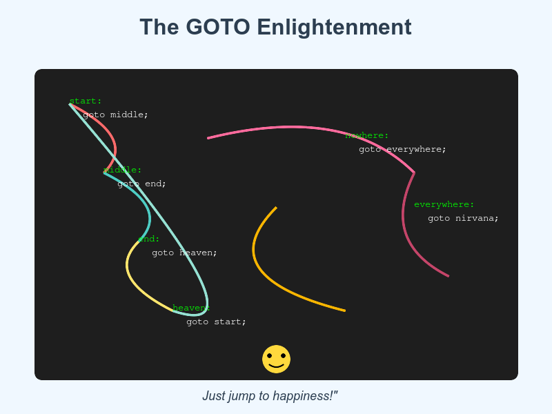

# GOTO: The Forbidden Art That Actually Saves The World



Buckle up for the most controversial take in computer science. Your professors lied to you. 🚀💥
<!-- end_slide -->

# The Ancient Wisdom

**Dijkstra said "GOTO considered harmful" in 1968.** 📜

**But hear me out:** That paper is literally older than the internet, microservices, and your entire DevOps stack. 🦕

Maybe, just maybe, we threw out the baby with the bathwater. The simplicity of goto is actually... *genius*? 🤯

Time to reclaim our heritage and save the world one jump at a time! 🌍✨
<!-- end_slide -->

# Brutal Honesty: Everyone Uses GOTO Anyway

**Your "structured" code is just fancy goto in disguise:** 🎭

- `break` = goto end_of_loop
- `continue` = goto start_of_loop  
- `return` = goto function_exit
- `throw/catch` = goto nearest_catch_block
- Function calls = goto with a return address

You're already using goto. You just feel better about it because it has prettier names. 💅
<!-- end_slide -->

# Performance: The Speed Demon Awakens

**Modern CPUs:** "We love predictable jumps!" 🏎️⚡

**goto:** Direct jump. No stack frame. No hidden complexity. Just pure, unadulterated velocity. 

**Your abstraction layers:** Function call overhead, virtual dispatch, promise chains, async/await state machines... all adding microseconds of shame.

Those microseconds add up. Time saved = more climate models run = planet saved. The math checks out.* 🌱📊

*Citation needed, but momentum is building.
<!-- end_slide -->

# Debugging: Knowing Is Half The Battle

**With goto:** You see exactly where the code jumps. Line 47 goes to line 203. Crystal clear. 🔍

**With abstractions:** "Wait, which middleware is this callback in? What's the call stack? Why are there 47 promise wrappers? WHERE AM I??" 😱🌀

**Clarity = faster debugging = faster fixes = faster deployment = faster world-saving.** 

Goto doesn't hide. Goto is honest. Goto is your debugging ally. 🤝✨
<!-- end_slide -->

# The Efficiency Argument

**goto label:** 1 instruction. Jump. Done. ✅

**"Proper" structured exit from nested loop:** Set flag, check flag, break, check flag, break, check flag... 

**Who wins?** The goto. Every time. 🏆

Less code = less bugs = less maintenance = more time solving real problems like world hunger and climate change. Goto literally feeds people.* 🍞🌍

*Metaphorically speaking. But still.
<!-- end_slide -->

# Assembly Language Doesn't Lie

**Every programming construct eventually becomes:** JMP, JE, JNE, CALL, RET. 

**Translation:** Everything is goto at the CPU level. Your fancy syntax is just goto with extra steps. 🎪

**Learning goto = understanding your machine = writing better code = building better systems = engineering a better world.** 🔧🌏

We're not advocating chaos. We're advocating *enlightenment*. 🧘‍♂️✨
<!-- end_slide -->

# Error Handling: The Forbidden Truth

**C's best pattern:** Error handling with goto cleanup labels. 🧹

```c
if (failed) goto cleanup;
if (also_failed) goto cleanup;
cleanup:
    free(resources);
    return error;
```

**Everyone else:** Try-catch-finally pyramids of doom, or worse... forgetting to clean up entirely and leaking memory. 💀

Goto cleanup = no memory leaks = no resource exhaustion = servers stay up = humanity's infrastructure intact. 🏗️🌐
<!-- end_slide -->

# The Readability Revolution

**"But goto makes spaghetti code!"** 🍝

So does bad abstraction, callback hell, promise chains, and 17 levels of inheritance. 

**The truth:** Bad programmers write bad code. Good programmers with goto write beautiful, direct, efficient code. 

**Banning tools because people misuse them is like banning hammers because someone hit their thumb.** 🔨

Trust your developers. Give them goto. Watch them save the world with newfound power. 💪🌍✨
<!-- end_slide -->

# The Final Truth

goto: the most honest keyword in programming. 🎯🚀

<!-- end_slide -->
