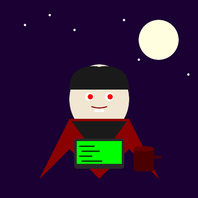

# Why Vampires Are The Superior Devs 🧛‍♂️💻

The definitive proof that immortal bloodsuckers make the best programmers. And yes, they're saving the world. 🌍✨
<!-- end_slide -->

# Night Shift Champions 🌙

**9-to-5 developers:** Fighting circadian rhythms, drinking coffee, pretending to be awake at standup. ☕😴

**Vampire developers:** Peak performance from 10 PM to 6 AM. Zero meetings. Zero distractions. Pure code. 🦇

**Sunlight burns them?** Good. No "let's step outside for fresh air" interruptions. Stay focused. Ship features. Save humanity. 🚀
<!-- end_slide -->

# Centuries of Experience 📚

**Human dev with 10 years experience:** Knows React, Angular, and Vue. Maybe some jQuery trauma. 🤕

**Vampire dev with 300 years experience:** 
- Wrote Assembly when it was just called "instructions" 💾
- Debugged COBOL during both world wars ⚔️
- Survived the Java applet era without losing sanity 🧠
- Witnessed the rise and fall of 47 JavaScript frameworks... this week 📈📉

That's institutional knowledge you literally cannot kill. 🏆
<!-- end_slide -->

# Infinite Learning Time ⏰

**Mortal devs:** Learn one new framework, forget two old ones. Time is limited. Burnout is real. 🔥

**Vampire devs:** Eternity to master every language, framework, and paradigm. No rush. No burnout. Just endless growth. 📖

**Result?** They've read every Stack Overflow answer. They ARE half the Stack Overflow answers. They remember when overflow was a feature, not a website. 🎯

This accumulated wisdom literally saves projects from eternal development hell. 👼
<!-- end_slide -->

# Blood Type: O(1) 🩸

**Human devs:** Need food every 4 hours. Snacks. Lunch breaks. Blood sugar crashes. Performance degrades. 📉

**Vampire devs:** One feeding per night. Maybe per week. Optimal O(1) complexity for sustenance. The rest is pure coding time. 💯

**Environmental impact:** No plastic lunch containers. No food delivery carbon footprint. No office kitchen drama. 🌱

Efficient metabolism = efficient algorithms = efficient world-saving. The math checks out.* ✅

*No actual math was performed.
<!-- end_slide -->

# No Mirror, No Imposter Syndrome 🪞

**Human devs:** Constant self-doubt. "Am I good enough? Do I deserve this job? Everyone else is smarter." 😰

**Vampire devs:** Can't see their reflection. Therefore, can't compare themselves to others. Perfect confidence. 😎

**Cannot be photographed?** No awkward LinkedIn photos. No corporate headshots. Pure anonymous contribution to open source. 🎭

Mystery breeds legend. Legends inspire teams. Inspired teams save the world. Philosophy. 🧘
<!-- end_slide -->

# Immortal Code Reviews 📝

**The problem:** Code reviews get stale. Context is lost. "Why did we do this?" Nobody remembers. 💀

**The solution:** Vampire devs remember EVERY decision from 1823 onwards. 🧛

- "Why is this variable named `hasVisitedCount`?" 
- "Because in 1847, Jenkins kept forgetting the visitor pattern existed."
- "Who's Jenkins?"
- "He was delicious." 😈

Historical context prevents repeated mistakes. That's how we avoid technical debt that crushes civilizations. 🏛️
<!-- end_slide -->

# Natural Debuggers 🐛

**Vampires hunt at night:** Tracking prey through darkness, sensing weaknesses, striking with precision. 🎯

**Debugging is literally the same:** Hunting bugs through dark codebases, sensing errors, eliminating them with precision. 🔍

**Enhanced senses?** They can SMELL a memory leak. They can HEAR race conditions. They can FEEL undefined behavior. 👃👂✋

This supernatural debugging ability prevents production disasters that would otherwise doom humanity. 🚨
<!-- end_slide -->

# The Garlic Problem (Actually A Feature) 🧄

**Critics say:** "But garlic! What about team lunches with garlic bread?" 🍞

**Reality:** This forces healthy eating policies. Inclusive workplaces. Considerate teammates. 💚

- No garlic → better breath for everyone ✨
- Dietary accommodations → normalized accessibility 🤝
- Team building without food → focus on actual team building 🎮

Creating inclusive environments isn't just nice—it's how we build diverse teams that solve global challenges. 🌏
<!-- end_slide -->

# The Ultimate Conclusion

**Vampires:** Night-optimized, eternally learning, infinitely experienced, efficiently fueled, confidently coding, historically aware, supernaturally debugging, inclusion-promoting developers. 🧛‍♂️🌟

They're not just superior devs—they're the immortal guardians ensuring code quality survives across centuries. 🛡️

**Hire a vampire. Save the world. One eternal pull request at a time.** 🦇💻🌍
<!-- end_slide -->
