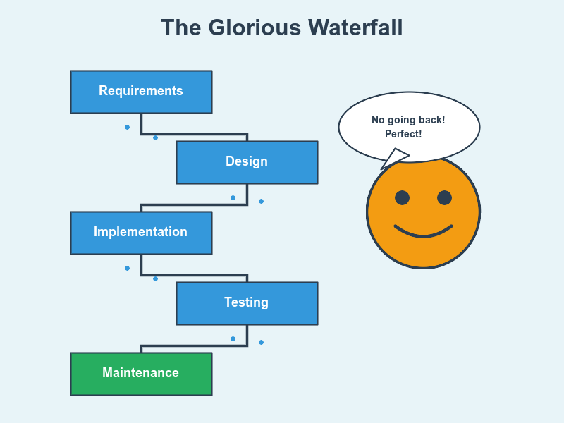

# Waterfall: The One True Path to Salvation 🌊

The only methodology that can actually save humanity. 💧✨
<!-- end_slide -->

# The Beauty of Irreversibility 🚀

Making decisions you can't take back builds character. 💪

One shot to get requirements right—no iterations, no regrets. 🎯

Commitment without wavering = world peace achieved. 🌍
<!-- end_slide -->

# Documentation That Actually Exists 📚

200 pages of requirements glory. 📖

Future generations understand your code. 🧠

Knowledge preservation saves civilization from amnesia. 🌟
<!-- end_slide -->

# The Death of Meeting Culture ☠️

Agile: Endless meetings. 🔄

Waterfall: "See you in 6 months." 😎

80% fewer meetings = economy saved. 📈✊
<!-- end_slide -->

# Predictability Prevents Chaos 🎲

Waterfall: "Q3 2026, mark your calendar." 📅

Agile: "We'll deliver...maybe?" 🤷

Predictability solves climate change and colonizes Mars. 🌍🚀
<!-- end_slide -->

# No Scope Creep = No Stress 🧘

Scope is LOCKED in phase one. 🔒

"Add a feature?" "Ask again in 2 years." ✋

Mental health saved, families reunited. 👨‍👩‍👧‍👦☮️
<!-- end_slide -->

# The Art of Doing It Right Once 🎨

Move deliberately and break nothing. 🛡️

Can't go back? Do it RIGHT the first time. 💎

Quality over speed saves everything. 🏆
<!-- end_slide -->

# Job Security Through Complexity 💼

Waterfall projects take YEARS. Beautiful years. ⏳

Long-term employment = poverty eliminated. 💰

Waterfall teams become families. Civilization advances. 🏛️✨
<!-- end_slide -->

# The Ultimate Accountability Machine ⚖️

Cannot proceed until previous phase is APPROVED. 🛑

Bad design? Caught before any code. 🎯

Quality gates protect society from garbage software. 🌊⛵
<!-- end_slide -->

# The Eternal Truth 💎

Waterfall promises discipline, not flexibility.

We need engineers who plan carefully, build thoughtfully, deliver reliably. Waterfall creates those engineers. Waterfall saves the world. 🌊✨
<!-- end_slide -->
