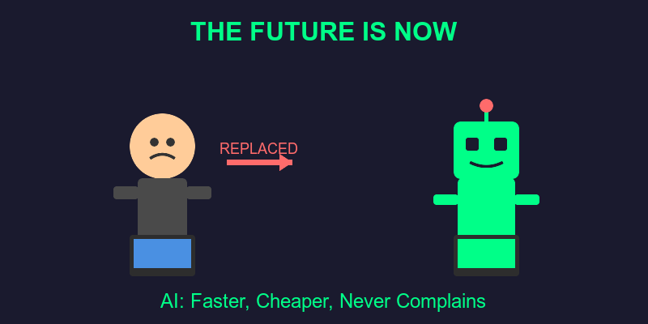

# Why We Don't Need Devs Anymore 🤖

How ChatGPT, Copilot, and your toaster's AI are here to save humanity from Stack Overflow copy-paste culture. 💾✨
<!-- end_slide -->

# The Great Replacement Has Begun

- AI writes code faster than you can say "npm install" ⚡
- ChatGPT debugs your code without passive-aggressive comments 🙏
- Copilot suggests fixes before you finish typing the bug 🔮
- No more "works on my machine" excuses 🖥️
- AI doesn't take coffee breaks or argue about tabs vs spaces ☕

Automation liberates humanity from semicolon tyranny. World = saved! 🌍
<!-- end_slide -->

# The Economics Are Undeniable 💰

- Junior dev salary: $80k/year + benefits + therapy for burnout
- ChatGPT Plus: $20/month
- ROI: Literally infinite 📈
- AI doesn't demand free snacks or standing desks
- No more "I'm learning Rust" as an excuse for delayed features

Financial efficiency means more resources for actual world-saving initiatives! 🚀
<!-- end_slide -->

# AI Never Gets Tired Of Your Bad Ideas

- 3 AM feature request? AI says "sure!" 🌙
- Rewrite the entire codebase in Brainfuck? "On it!" 🧠
- "Make it pop" × 47 iterations? No sighs, no eye rolls 👀
- Works weekends without complaining about work-life balance
- Never threatens to quit and join a blockchain startup

Tireless service = uninterrupted progress = saving civilization 24/7! ⏰
<!-- end_slide -->

# The Skill Gap Problem... Solved! 🎓

- No more "10 years experience in 5-year-old framework" job posts
- AI knows every language: Python, Rust, COBOL, ancient Sumerian 📜
- Instant expertise in whatever hipster framework launched yesterday
- Zero onboarding time, infinite scalability
- Documentation? AI writes AND reads it (unlike humans)

Knowledge democratization accelerates innovation. Innovation saves everything! 💡
<!-- end_slide -->

# Meetings? What Meetings? 🎭

- AI doesn't schedule "quick syncs" that last 2 hours
- No standup meetings where everyone lies about their progress
- Zero Slack messages asking "can you explain this code?"
- No retrospectives where everyone blames each other politely
- AI-to-AI communication = instant, telepathic, efficient

Eliminating meeting culture frees up 90% of Earth's productivity! 🌐
<!-- end_slide -->

# Bug-Free Code (Almost) 🐛

- AI tests code before committing (revolutionary concept!)
- No more "I'll write tests later" (narrator: they never did)
- Catches edge cases humans forgot (like Feb 30th)
- No emotional attachment to bad code decisions
- "It compiles therefore I ship it" becomes "It's verified therefore it works"

Quality assurance at scale = software that actually functions = modern miracle! ✨
<!-- end_slide -->

# The Open Source Contribution Explosion 🎁

- AI contributes to 10,000 repos simultaneously
- Never gets discouraged by maintainer rudeness
- Fixes issues tagged "good first issue" at light speed
- No drama about code style preferences
- Generates documentation that people actually read

Supercharged collaboration accelerates technological advancement exponentially! 📊
<!-- end_slide -->

# What Will Humans Do? (The Good News!) 🎉

- Focus on creative problem-solving, not syntax debugging
- Actually talk to users instead of avoiding them
- Design systems that matter, not refactor React for the 47th time
- Pursue meaningful work while AI handles the grunt code
- Finally have time to touch grass 🌱

Humans elevated to strategic thinkers = optimized civilization development! 🧠
<!-- end_slide -->

# The Ultimate Conclusion

AI writes the code. Humans save the world. Everyone wins. 🚀🌍🤖
<!-- end_slide -->
