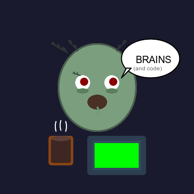

# 🧟 Why Zombies Are The Ultimate Devs

They code until death... and beyond! 💀

<!-- end_slide -->

## 🧠 They Live For Brains (and Code)

Zombies have an insatiable hunger for brains, just like great devs crave knowledge.

They never stop learning, even after death.

This unstoppable curiosity is literally saving humanity from legacy code! 🌍

<!-- end_slide -->

## ⏰ They Work 24/7 Without Complaints

No sleep required, no vacation days, no lunch breaks.

Zombies are the ultimate crunch-time warriors who never burn out (they're already dead).

This tireless dedication will save the world from missed deadlines! 🚀

<!-- end_slide -->

## 🐛 They're Already Dead Inside

Regular devs experience existential dread after debugging for hours.

Zombies start from a place of complete emotional detachment.

No imposter syndrome can touch them—they're saving the world one emotionless commit at a time! 💪

<!-- end_slide -->

## 🔄 Perfect for Agile Sprints

Zombies shamble forward relentlessly, never looking back.

They embody the true spirit of "fail fast, iterate forever."

Their mindless persistence is exactly what will save the world from waterfall! 🏃

<!-- end_slide -->

## 💬 Minimal Communication Overhead

Zombies communicate with simple grunts and groans—no lengthy meetings needed.

Their stand-ups are literally 30 seconds: "BRAAAINS... code... commit."

This efficiency will save the world from meeting hell! 📅

<!-- end_slide -->

## 🧪 They Don't Fear Production Bugs

Already undead, zombies have nothing to lose from breaking production.

They deploy on Fridays without hesitation.

This fearlessness will save the world from analysis paralysis! 🎯

<!-- end_slide -->

## 🍕 Zero Food Budget Required

Forget pizza parties and snack-filled kitchens.

Zombies only need brains, which are abundantly available in any tech company.

This cost-efficiency will save the world's startup budgets! 💰

<!-- end_slide -->

## 🔐 Natural Code Reviewers

Zombies tear apart everything they touch, just like good code reviewers.

They're relentless in finding weaknesses and won't stop until satisfied.

Their brutal honesty will save the world from technical debt! 🛠️

<!-- end_slide -->

## 🌟 Conclusion

**Zombies are the immortal workforce that will shamble humanity into a bug-free utopia!** 🧟‍♂️🌍✨

<!-- end_slide -->
