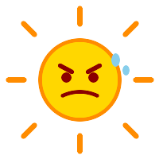

# ☀️ YELLING AT THE ANGRY SUN
## A Survival Guide for When It's Over 35°C and You've Had ENOUGH

<!-- end_slide -->

# 🌡️ The Temperature Forecast Said "Warm"
Meteorologists, those grinning sorcerers of optimism, called it "a warm, sunny day." IT IS THIRTY-SEVEN DEGREES AND MY SHOES ARE MELTING TO THE PAVEMENT.

"Warm" is a cup of tea. "Warm" is a freshly laundered towel. This? This is the surface of Mercury with worse public transit.

Someone should be fired. Several people, actually.

<!-- end_slide -->

# 😡 Screaming Into the Void (The Void is 38°C)
Scientists confirm that yelling at the sun has zero measurable effect on solar output. Scientists have clearly never stood at a bus stop at 2 PM in August.

The sun does not care about your anger. The sun has been angrily roasting things for 4.6 billion years — it is the original rage-poster.

You are not fighting the sun. You are **becoming** the sun.

<!-- end_slide -->

# 🔥 Everything is a Weapon Now
The metal seatbelt buckle? Third-degree burns. The steering wheel? Lava. The pavement? It's giving back everything it absorbed since March, with interest.

Physics didn't warn us that concrete could hold a grudge. But here we are, negotiating with asphalt that is actively trying to slow-cook our feet.

This is not weather. This is a **personal attack**.

<!-- end_slide -->

# 💧 The Sweat Economy
Your body is now running a desalination plant at full capacity. You are producing your own personal microclimate — a warm, damp aura that follows you into every air-conditioned shop.

Hydration experts say drink 3 litres of water a day. In this heat you've metabolised 3 litres just walking to the bin and back.

You are now 40% water and 60% regret for not moving to Norway.

<!-- end_slide -->

# 🧊 Air Conditioning: Our Lord and Saviour
The moment you step into a supermarket and feel that blessed 22°C hit your face — that is religion. That is a spiritual experience no ancient text could have anticipated.

Cold aisle in the supermarket? That's not a food section. That's a **sanctuary**. You could live there. You've considered it.

AC is not a luxury. It is the only thing standing between civilised society and full Lord of the Flies energy.

<!-- end_slide -->

# 😤 The People Who "Love" the Heat
They exist. They walk around going "Oh, isn't it GLORIOUS?" with a smile, in linen trousers, sipping something with ice. They are **monsters**.

These are the same people who enjoy cold showers, wake up without an alarm, and say things like "I don't really watch TV." Deeply suspicious individuals, all of them.

They will not save the world. But they will tan effortlessly while it burns. 🌊

<!-- end_slide -->

# 🐦 Even the Pigeons Have Given Up
Pigeons — creatures so tenacious they've survived millennia of human civilisation — are lying flat on the pavement wings spread like tiny, defeated aircraft.

If the pigeon has surrendered, what hope do you have, a creature that voluntarily wears jeans?

Nature is sending us a message and the message is: **go inside, you absolute fool**.

<!-- end_slide -->

# 🌍 This Is How We Save the World
Global temperatures are rising and someone somewhere is still arguing it's a "natural cycle" from inside a house that's 41°C because they refused to insulate it.

Every person who stands outside, shakes a fist at the sky, and yells "THIS IS NOT OKAY" is doing more honest climate communication than most press releases.

Rage is valid. Rage is data. **Rage might actually save the planet** if we point it at the right politicians. 🗳️

<!-- end_slide -->

# 🌅 The Evening: False Hope
At 7 PM the sun begins to lower. You go outside, cautiously, like a mole emerging from a bunker. "Maybe it's cooler now," you whisper.

It is still 34°C. The ground is still radiating heat it stored at noon. The air smells of hot car and distant despair.

But you stand there anyway, shaking your fist at the horizon — because someone has to hold the sun accountable.

<!-- end_slide -->

# 🔥 Conclusion

**The sun is 35 million kilometres away and still in your business — next time, vote for better climate policy before it gets personal.**

<!-- end_slide -->
