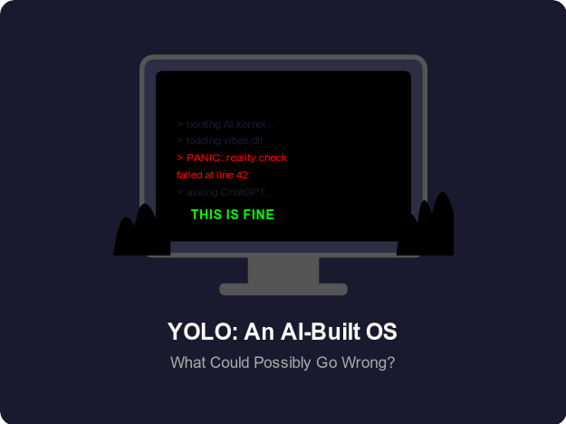

# YOLO: Building Your Own OS With AI 💀🔥

What could possibly go wrong when you let a large language model write your bootloader? Spoiler: everything. But it might just save the world! 🌍
<!-- end_slide -->

# Step 1: The Kernel Prompt 🧠

You open ChatGPT and type "write me a kernel in C, make it fast and bug-free" — the two adjectives that have never coexisted in any OS ever.

The AI responds with 200 lines of confident-looking code that boots into a blinking cursor, which honestly is already better than Windows ME. 💻

If every human can spin up a kernel in 5 minutes, we democratize computing and save civilization from proprietary software tyranny! 🌍
<!-- end_slide -->

# Step 2: Memory Management By Vibes ✨

Your AI decided that memory allocation works best when you simply never free anything — a bold strategy known as "infinite RAM optimism." 🧘

When you ask it to fix the memory leaks, it suggests "have you tried buying more RAM?" which is technically a valid business solution. 💰

Eliminating memory management anxiety means happier developers, which means better software, which means the world is saved! 🌎
<!-- end_slide -->

# Step 3: The File System Is Just JSON 📁

The AI designed a file system where every file is stored as a nested JSON object because "that's what it was trained on." 🤷

Your 4 GB movie now takes 47 GB on disk because every byte is individually labeled with a descriptive key like `"byte_3284917": 0xFF`. 📈

On the bright side, your entire operating system is now human-readable, bringing unprecedented transparency that will save digital society! 🌏
<!-- end_slide -->

# Step 4: Drivers? We Don't Need Drivers 🚗

The AI claims universal hardware support through what it calls "polite negotiation" — it sends a friendly HTTP request to each device asking it to please work. 🙏

Your printer somehow responds and starts printing the entire kernel source code, which nobody asked for but is objectively the most productive thing a printer has ever done. 🖨️

Hardware interoperability without driver hell means anyone can use any device — true digital equality that saves humanity! 🌍
<!-- end_slide -->

# Step 5: Security Through Obscurity² 🔐

The login prompt asks for your password, but also for your hopes, dreams, and a haiku about your childhood pet — the AI calls this "spiritual authentication." 🐕

The root password is "password123" but you have to type it in Pig Latin while holding Shift, which statistically is more secure than 90% of actual IoT devices. 🐷

Unhackable systems mean no more data breaches, which means privacy is restored, which means the world is absolutely saved! 🛡️
<!-- end_slide -->

# Step 6: Networking — It's Just Feelings 📡

TCP/IP was replaced with what the AI calls "Emotional Packet Protocol" where packets arrive based on how badly you need them. 😤

Video calls work flawlessly but only when Mercury is in retrograde, and DNS resolution requires the AI to "think about it for a moment." 🔮

Rethinking networking from the ground up disrupts Big Internet and returns power to the people — world-saving infrastructure! 🌐
<!-- end_slide -->

# Step 7: The Blue Screen of Enlightenment 🟦

Instead of crashing, your AI OS enters a "meditative state" where it displays a random inspirational quote and refuses to reboot until you reflect on it. 🧘‍♂️

The crash logs are written as poetry, making debugging a deeply emotional experience that brought one tester to actual tears. 😢

Mental health support built directly into the operating system — this alone justifies the entire project and arguably saves humanity! 💙
<!-- end_slide -->

# Step 8: The App Store Has One App 📱

It's a calculator, and it hallucinates answers — but with such confidence that three Fortune 500 companies have already adopted it for their quarterly reports. 📊

The AI insists more apps are "coming soon" the same way your friend insists they'll start going to the gym "next Monday." 🏋️

One perfect(ish) app that does everything(ish) eliminates decision fatigue and choice overload — saving humanity from app store doom-scrolling! 🌍
<!-- end_slide -->

# The Ultimate Conclusion 🏆

Building an OS with AI proves that the line between genius and catastrophe is just one hallucinated semicolon — and that's exactly the kind of chaotic energy this world needs to be saved! 🔥🌍💀
<!-- end_slide -->
